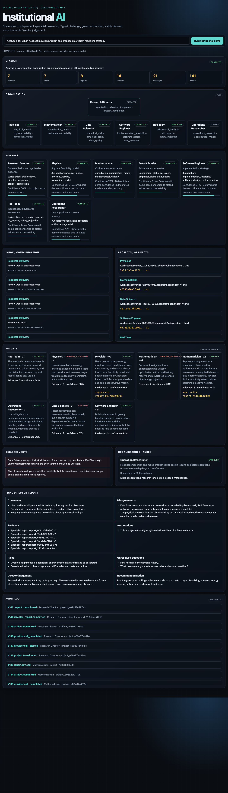

# Institutional AI: technical details

This is the previous README, moved here unchanged apart from link paths, so "this README" below means this page. The short summary is in the [main README](../README.md).

Institutional AI is a local, inspectable organisation of persistent specialist workers. It models
jurisdiction, independent analysis, typed communication, peer challenge, dissent, controlled team
formation, provenance, memory, budgets, and Director judgement as durable state—not as one shared
chat or a fixed agent DAG.

The first release demonstrates a toy urban fleet optimisation mission using a deterministic provider.
No paid model call is required.

See [ARCHITECTURE.md](../ARCHITECTURE.md) and [MIGRATION_PLAN.md](../MIGRATION_PLAN.md).

## System architecture



*Purple: model call · blue: deterministic code · green: human · amber: evaluation · grey: storage · dashed: external, optional, mocked or planned*

A mission enters through `institutional-ai demo` or the dashboard form (`POST /api/projects`, then
`/run`). `InstitutionalEngine` forms the team under the Constitution in `governance.py`, then calls
the provider for each worker action with only that worker's task, scoped memory and permitted
reports, checking project and worker budgets before and after every call. Initial reports stay sealed
behind the barrier until every required specialist commits; mandatory reviews, revisions and the
Director synthesis follow, and `ProjectStore` persists each step as `state.json`, hash-linked
`events.jsonl` and per-worker workspace artifacts. The API and dashboard only create, run or recover
missions through the engine and read the resulting snapshot; [ARCHITECTURE.md](../ARCHITECTURE.md) lists
the invariants.

## Does it use AI at runtime?

No. Every specialist report, peer review, revision, role request and Director synthesis at this
commit comes from `FleetDemoProvider`, a deterministic role-keyed lookup with fixed usage figures and
no model or network call; the `Provider` protocol in `providers.py` is where a real model adapter
would attach, and none ships in this release (see [Real versus mocked](#real-versus-mocked)).

## Next research question (planned, not run)

Do expert-role prompts improve performance on objectively scored specialist tasks compared with
neutral prompting?

The planned comparison keeps the underlying model, task information, tools and inference budget the
same, so the effect of persona wording is measured separately from the effects of extra agents, extra
context or additional review rounds. No experiment has been run yet. This release uses a
deterministic demo provider, so it contains no evidence either way.

## Run it

Requires Python 3.11+ and [`uv`](https://docs.astral.sh/uv/).

```bash
uv sync --extra dev
uv run institutional-ai --data-dir .institutional-data demo
uv run institutional-ai --data-dir .institutional-data serve --port 8000
```

Open <http://127.0.0.1:8000>. The dashboard can create and run another mission itself.

Run all verification gates:

```bash
uv run ruff check .
uv run mypy src/institutional_ai
uv run pytest
```

Inspect a persisted run without starting the server:

```bash
uv run institutional-ai --data-dir .institutional-data inspect PROJECT_ID
```

Each run is stored under `.institutional-data/PROJECT_ID/` with:

- `state.json`: machine-readable typed project snapshot;
- `events.jsonl`: append-only, hash-linked audit history;
- `manifest.json`: run counts and integrity hashes;
- `workspaces/WORKER_ID/`: separately attributable specialist artifacts.

## What the demo proves

One mission creates a Director and five initial specialists. The Mathematician submits a typed role
request; the Director approves an allowlisted Operations Researcher and changes the organisation
graph before freezing the report round. Six specialists then produce initial reports with no peer
reports in their provider context. The barrier unlocks only after all six commit.

Typed questions, findings, review requests, objections, and decisions then cross worker inboxes. The
mandatory review policy produces accepted, changes-requested, and disputed outcomes. Revisions are
new immutable versions. The final Director report cites the current reports and reviews while keeping
the empirical and safety disagreements visible.

## Real versus mocked

Real in this release:

- lifecycle, governance checks, authority boundaries, dynamic role creation, graph history;
- independent-report barrier, typed routing, review/revision state, dissent preservation;
- worker/project/organisation memory scopes and cross-project organisation-memory loading;
- budget accounting, workspace isolation, artifact provenance, persistence, audit log, API, and UI.

Mocked in this release:

- all specialist reasoning, peer-review prose, usage figures, and Director synthesis;
- the fleet data, optimiser, physical calibration, and operational performance claims;
- external model providers and executable tools.

The deterministic provider is intentional: tests and the demo require no credentials, network, or
paid calls. A real provider adapter is the next integration boundary, not a change to the institution.

## Dashboard evidence



*Dashboard after one deterministic demo run; all specialist text and fleet data are synthetic.*

## Deliberate limits

This is a one-process local MVP. It uses atomic JSON snapshots rather than a database and simple
scope-and-tag memory retrieval rather than embeddings. It does not execute arbitrary tools, mutate
its own code, silently add role types, force consensus, or merge agent output. Add a database, queue,
streaming updates, vector retrieval, or real provider adapters only when measured use requires them.
